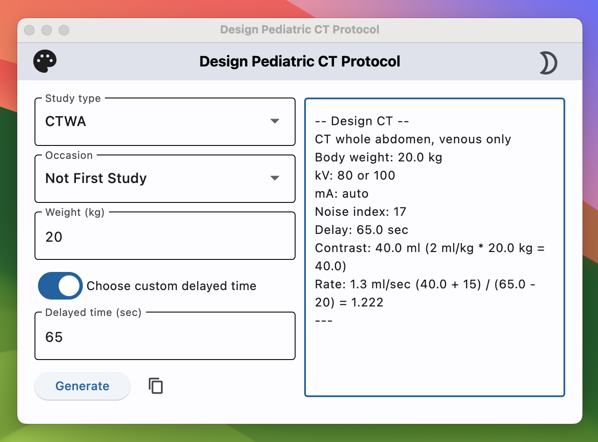

# Design Pediatric CT (Flet App) <a href="https://github.com/Lightbridge-KS/PedDesign-flet"></a>

> **Cross-platform app for design pediatric CT protocol.**



**Build using [Flet](https://flet.dev/)**, a cross-platform UI framework in Python.

- **Web app:** <https://peddesign-lightbridge.netlify.app>

- **Desktop app:** see [release](https://github.com/Lightbridge-KS/PedDesign-flet/releases)

## Build from Source

### Installation

1. Install [flet](https://flet.dev/docs/guides/python/getting-started) and [pyperclip](https://pypi.org/project/pyperclip/) with:

```shell
pip install -r requirements.txt
```

2. [Install Flutter](https://docs.flutter.dev/get-started/install)


### Build app

```shell
cd to/directory
# Build
flet build <target_platform>
```

`<target_platform>` could be one of the following: `apk`, `aab`, `ipa`, `web`, `macos`, `windows`, `linux`.


## Remark

> Please be aware that the actual design of a pediatric CT protocol for clinical use demands oversight by a qualified pediatric radiologist. The 'PedDesignCT' application serves as an initial planning, educational/inspirational tool, and is not designed for immediate clinical implementation. It is essential that any protocols generated by this app undergo a comprehensive review by specialists and be tailored specifically to align with the practices of your institution and the individual needs of each patient. This application is not a substitute for professional judgment and expertise." 